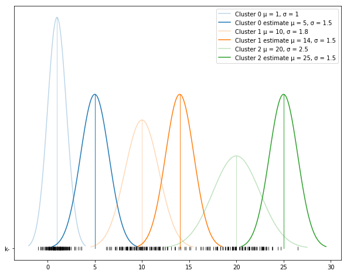
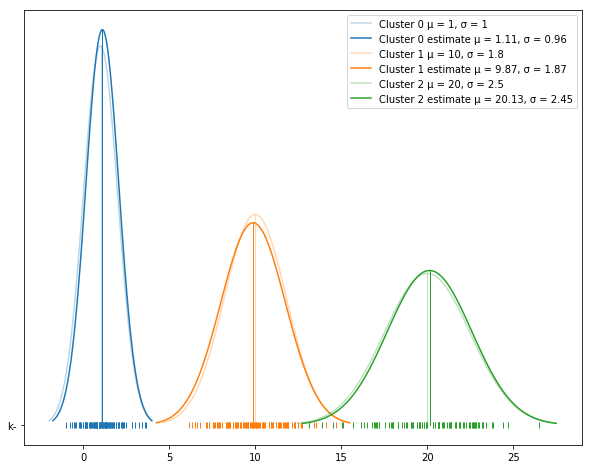

<h1>Expectation Maximization - A Python implementation</h1>
<p align="left" style="font-size:13px;"><b>Christoph Winkler</b><br>
<i>M. Sc. Business Information Systems, Data Scientist<br>
Generative Modeling is simply about modeling "How the world could be" and not necessarily "How the world actually is".</i></p>

Let's recap what was learned in <a href="https://chriswi93.github.io/Expectation-Maximization-An-explanation-of-statistical-inference-using-the-example-of-GMMs/">Expectation Maximization - An explanation of statistical inference using the example of Gaussian Mixture Models</a> by showing an implementation in Python.

```python
import numpy as np
import matplotlib.pyplot as plt
import scipy.stats as stats
import math
```

First, let's initiate the parameters. We use the relaxed assumption that the cluster size is known K = 3. Our prior distribution for cluster assignments is symmetric (<i>1/K</i> for each k &isin; <i>{1,...K}</i>). The weight matrix with values p(x|z,&mu;,&sigma;) is represented by the variable w. Additionally, we define two convergence criteria. If the change of data likelihood between two iterations is very small (tol), the algorithm is stopped. Otherwise the algorithm is stopped after at least 100 iterations (max_iterations).
```python
K = 3 # number of clusters
phi = np.array([ 1/K ] * K) # prior (symmetric) distribution for cluster assignment
w = np.zeros((x.shape[0], K)) # weight matrix for p(x|z,μ,σ)
tol = 1e-8 # convergence threshold of data likelihood
max_iterations = 1000 # max iterations if convergence threshold is not met
likelihood = np.iinfo(np.int32).max # initial value for data likelihood

true_mu = [1, 10, 20] # true μ
true_sigma = [1, 1.8, 2.5] # true σ

mu = [5, 14, 25] # initial guess of μ
sigma = [1.5] * 3 # initial guess of σ
```

Next step is to sample some random data x from our true posterior (100 for each cluster).
```python
x_list = []
for m, s in zip(true_mu, true_sigma):
    x_list.append(np.random.normal(m, s, 100)) # sample data from the true posterior
x = np.concatenate(x_list)
np.random.shuffle(x) # randomly shuffle the data
```

The function below helps to plot the true and estimated distribution parameters.
```python
def plot_clusters(true_mu, true_sigma, mu, sigma, x_list, x_color=False):
    """
    Plot true and estimated distribution parameters.
    """
    labels = []
    plt.figure(figsize=(10, 8))
    for i, (true_m, true_s, m, s) in enumerate(zip(true_mu, true_sigma, mu, sigma)):
        _x = np.linspace(true_m - 3*true_s, true_m + 3*true_s, 100)
        sample = stats.norm.pdf(_x, true_m, true_s)
        l, = plt.plot(_x, sample, color="C" + str(i), alpha=.3, label="Cluster {} μ = {}, σ = {}".format(i, round(true_m, 2), round(true_s, 2)))
        plt.plot([true_m, true_m], [0, np.max(sample)], "C" + str(i), "k-", alpha=.3, lw=1)
        labels.append(l)
        _x = np.linspace(m - 3*s, m + 3*s, 100)
        sample = stats.norm.pdf(_x, m, s)
        l, = plt.plot(_x, sample, color="C" + str(i), alpha=1, label="Cluster {} estimate μ = {}, σ = {}".format(i, round(m, 2), round(s, 2)))
        plt.plot([m, m], [0, np.max(sample)], "C" + str(i), "k-", alpha=1, lw=1)
        labels.append(l)
        if x_color is True:
            plt.plot(x_list[i], [0] * len(x_list[i]), "|", color="C" + str(i))
        else:
            plt.plot(x_list[i], [0] * len(x_list[i]), "|", color="black", alpha=.8)
    plt.legend()
```
Now let's plot the clusters with our initial guess and compare it to the true posterior. The initial guess is not bad, but far away from the true posterior.
```python
plot_clusters(true_mu, true_sigma, mu, sigma, x_list, x_color=False)
```


Here you can see the EM clustering algorithm on a very low level. The code is highly efficient due to the vectorization of the computation (avoiding loops). The computation is self-explaining if you read the recommended article above.
```python
for iteration in range(max_iterations):
    
    ### E-Step ###
    for k in range(K):
        w[:,k] = phi[k] * stats.norm.pdf(x, mu[k], sigma[k]) # update p(x|z,μ,σ)
    w = w / w.sum(axis=1, keepdims=True) # normalize weight matrix to get probability values
    
    ### M-Step ###
    phi = w.mean(axis=0) # update initial prior distribution of cluster assignment
    for k in range(K):
        norm = w[:,k].sum() # compute the norm factor of each cluster (pseudo count of assignments based on weight matrix)
        mu[k] = w[:,k].dot(x) / norm # update μ
        sigma[k] = np.sqrt(w[:,k].dot((x - mu[k])**2) / norm) # update σ
        
    ### compute data likelihood ###
    _likelihood = np.log(w.max(axis=1)).sum()
    print("Likelihood Iteration {}: {}".format(iteration, _likelihood))
    if np.abs(_likelihood - likelihood) <= tol: # check convergence
        break
    likelihood  = _likelihood
```
```python
Likelihood Iteration 0: -14.463677488636312
Likelihood Iteration 1: -44.33066539458294
Likelihood Iteration 2: -48.88573252958169
Likelihood Iteration 3: -47.40812344810275
Likelihood Iteration 4: -42.653970965305085
Likelihood Iteration 5: -34.72542206553427
Likelihood Iteration 6: -23.91971994861114
Likelihood Iteration 7: -13.660628911478527
Likelihood Iteration 8: -9.229549055788876
Likelihood Iteration 9: -7.210616473447327
Likelihood Iteration 10: -4.94204186097998
Likelihood Iteration 11: -3.6057406970129
Likelihood Iteration 12: -3.379919577174038
Likelihood Iteration 13: -3.0456646359009696
Likelihood Iteration 14: -3.0130312886570305
Likelihood Iteration 15: -3.0214645557149966
Likelihood Iteration 16: -3.000384625305947
Likelihood Iteration 17: -2.9686404269209907
Likelihood Iteration 18: -2.9240540665513066
Likelihood Iteration 19: -2.8989218685477893
Likelihood Iteration 20: -2.884242512464382
Likelihood Iteration 21: -2.875435639382534
Likelihood Iteration 22: -2.8700498772629377
Likelihood Iteration 23: -2.866712666707173
Likelihood Iteration 24: -2.8646265370542805
Likelihood Iteration 25: -2.8633149107862867
Likelihood Iteration 26: -2.862487141123597
Likelihood Iteration 27: -2.861963468944592
Likelihood Iteration 28: -2.8616316638911696
Likelihood Iteration 29: -2.8614212197460978
Likelihood Iteration 30: -2.861287663217715
Likelihood Iteration 31: -2.8612028686259636
Likelihood Iteration 32: -2.8611490190384834
Likelihood Iteration 33: -2.8611148157927078
Likelihood Iteration 34: -2.861093088920215
Likelihood Iteration 35: -2.8610792864861145
Likelihood Iteration 36: -2.86107051784478
Likelihood Iteration 37: -2.861064947007562
Likelihood Iteration 38: -2.8610614077190917
Likelihood Iteration 39: -2.861059159098859
Likelihood Iteration 40: -2.8610577304706424
Likelihood Iteration 41: -2.861056822808512
Likelihood Iteration 42: -2.861056246134468
Likelihood Iteration 43: -2.861055879749758
Likelihood Iteration 44: -2.8610556469702324
Likelihood Iteration 45: -2.8610554990755688
Likelihood Iteration 46: -2.861055405111795
Likelihood Iteration 47: -2.861055345412603
Likelihood Iteration 48: -2.861055307483146
Likelihood Iteration 49: -2.861055283384934
Likelihood Iteration 50: -2.8610552680743053
Likelihood Iteration 51: -2.861055258346803
```

What you can see in the output is that the likelihood of the data is increasing. Therefore, the model is getting better and better after each iteration.<br> 
Last step is to print out the estimated model parameters and compare the estimated model parameters with the true model parameters (the parameters that sampled the data). However, be aware that the result highly depends on the inital guess of the parameters and the dataset. 
```python
for i, (m, s) in enumerate(zip(mu, sigma)):
    print("Cluster {}: mean {}, sigma {}".format(i,m,s))
```
```python
Cluster 0: mean 1.1068575503801763, sigma 0.9587802502150544
Cluster 1: mean 9.8717915880446, sigma 1.8745443663481027
Cluster 2: mean 20.134222230802845, sigma 2.453386147898289
```
```python
plot_clusters(true_mu, true_sigma, mu, sigma, x_list, x_color=True)
```

<br>
As expected the model learned a good approximation of the parameters from the observed randomly sampled data.
